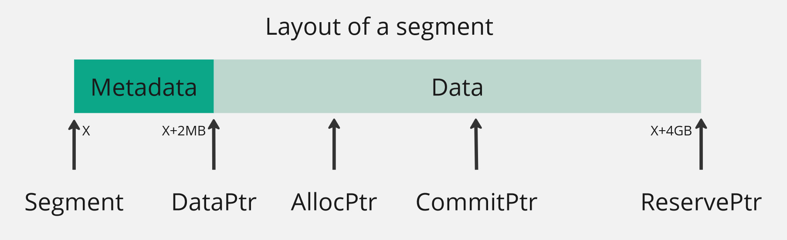

A conservative garbage collecter (Safe GC) for C. Safe GC implements a bump allocator that always returns an 8-byte address.

## Building
Build the project via `make`

## How does this work
Safe GC has three components: allocator, mark and sweep.

### Requirements
- Heap memory is always allocated via a safe memory management API (e.g., malloc).
- If a heap object (say obj) is live, then the application must store its data in the range `[obj, obj + sizeof(obj)]` in its address space.

### Allocator
Safe GC implements a bump allocator and a stop-the-world conservative garbage collector. The allocator maintains a list of segments. All objects are allocated from a segment. A segment is a 4-GB contiguous memory area. 



Physical pages to the segment memory are allocated on demand. `ReservePtr` points to the end of the segment. `CommitPtr` points to a memory area until which the physical pages have been allocated. `AllocPtr` is the head of the bump allocator. The first 2-MB of the segment is reserved for metadata. The rest of the segment is used by the bump allocator. `DataPtr` points to the first byte in the data region of a segment.

``` c

typedef struct ObjHeader {
	unsigned Size;
	unsigned Status;
	ulong64 Type;
} ObjHeader;
```

SafeGC adds an object header to each object. An object header contains the size, status, and type of the object. SafeGC doesn't use the type field of the object header; reserved for future use. The status field contains the validity of an object. When an object is freed, the status filed of the object is set to `FREE`. The status field can also be used by the mark phase to `MARK` reachable objects. The bump allocator never reuses a virtual address. When a segment is full, a new segment is created for future allocations. `myfree` is called to free an object. myfree reclaims the physical page associated with a virtual page when all the objects on the virtual pages are freed. A virtual page is a 4-KB contiguous memory area in the segment address space. A virtual page is also aligned to 4-KB size. Future accesses to a freed virtual pages result in segmentation faults. SafeGC reserves two bytes metadata corresponding to each virtual page in the segment. The metadata is stored in a contiguous 2-MB memory area at the top of the segment. The virtual page metadata tracks the number of free bytes on a virtual page. When the number of free bytes becomes equal to the size of a virtual page, the corresponding physical page is reclaimed. When the allocation size of an object is less than 4-KB (page size), SafeGC ensures that the object always lies on a single page. The top of a virtual page always contains the starting address (address of object header) of an object. Allocations of size more than 4-KB allocations are called big allocations. SafeGC implements a different allocation scheme for big allocations. For big allocations, the allocation size is adjusted to the nearest multiple of the page size. For these allocations, myfree immediately reclaims the physical pages. The metadata corresponding to the first page of a big allocation is set to one to identify the first byte of these objects. myfree sets the metadata corresponding to all pages of a big allocation to the page size. The metadata can be used by the mark and sweep phase to check the validity of a page before access, and also for the finding the object headers of big allocations.

### Mark
Scanning roots: It scans the heap and stack for the 8-bytes aligned valid heap address. After encountering a valid heap address it finds the object header corresponding to that address and `MARK` it if not adready marked and add it to the unscanned objects list. 

After scanning of the roots is complete. It iterates over each heap object in the unscanned objects list and check for references to valid heap addresses in that object. After encountering a valid heap address it proceeds to do the same as mentioned in the scan roots phase. 

### Sweep 
It iterates over all the valid heap addresses and fetch their corresponding object header if an object not marked and not freed is found it proceeds to free them using `myfree` routine.

> [!Warning]
> Due to viewing all the value which have holds a valid heap address as a pointer to the heap memory; a conservative garbage collector may incorrectly identify unreachable objects (whose addresses matches with an integer) as reachable, which could lead to a memory leak. Fortunately, in most applications, such cases are few, and thus it is practical to implement conservative garbage collection for them.

## Tests
Run tests using `make test`
``` console
/usr/bin/time -v ./random
total edges:4222800
Num Bytes Allocated: 476002816
Num Bytes Freed: 52107408
Num GC Triggered: 14
printing stats after final GC
Num Bytes Allocated: 476002816
Num Bytes Freed: 53603152
Num GC Triggered: 15
	Command being timed: "./random"
	User time (seconds): 8.36
	System time (seconds): 0.32
	Percent of CPU this job got: 99%
	Elapsed (wall clock) time (h:mm:ss or m:ss): 0:08.70
	Average shared text size (kbytes): 0
	Average unshared data size (kbytes): 0
	Average stack size (kbytes): 0
	Average total size (kbytes): 0
	Maximum resident set size (kbytes): 519588
	Average resident set size (kbytes): 0
	Major (requiring I/O) page faults: 2
	Minor (reclaiming a frame) page faults: 128639
	Voluntary context switches: 73
	Involuntary context switches: 10
	Swaps: 0
	File system inputs: 88
	File system outputs: 0
	Socket messages sent: 0
	Socket messages received: 0
	Signals delivered: 0
	Page size (bytes): 4096
	Exit status: 0
```
